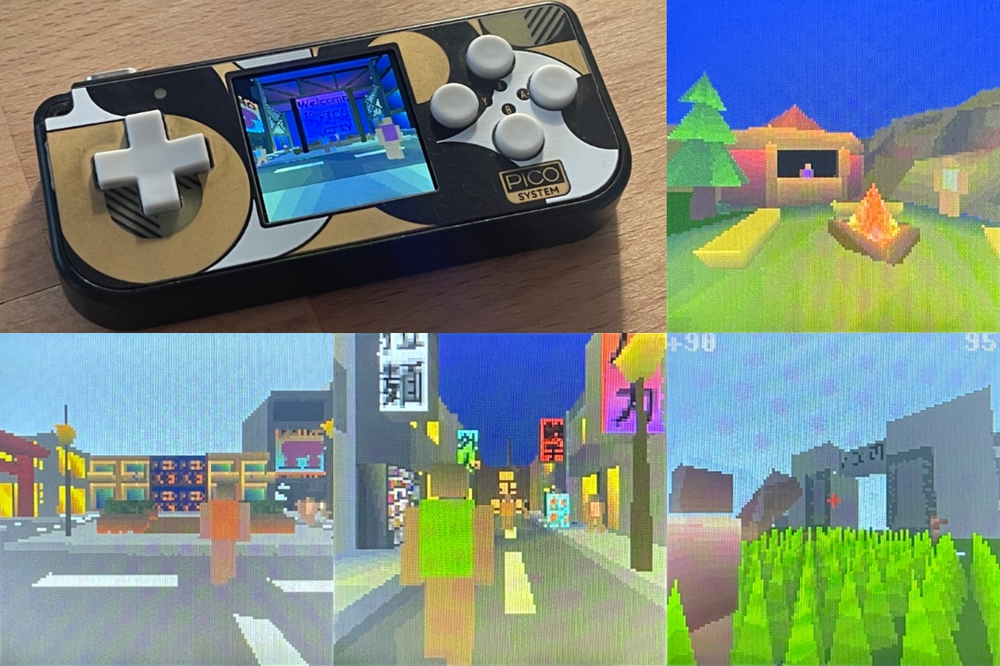

# Pico3D Engine for the Pimoroni PicoSystem

## Overview
This engine basically utilizes the second core of the RP2040 as a dedicated rasterizer/GPU.  
It contains a small city as well as an outskirts featuring shootable zombies.

[Gameplay video](https://www.youtube.com/watch?v=n6bECGQyNuk)  
[Demo video](https://www.youtube.com/watch?v=6WkltAOFDYs)

## Getting Started

If all you want are .uf2 binaries, check the releases for the newest version.

You will need the [PicoSystem SDK](https://github.com/pimoroni/picosystem) (and the required Pico SDK).  
Copy the whole Pico3D folder as an example project into picosystem/examples and add "add_subdirectory(pico3d)" entry into the CMakeLists.txt.

The project needs multi-core support to compile:  
Add pico_multicore to the target_link_libraries in picosystem.cmake found in picosystem/libraries.

You should now be able to compile all the examples including pico3d.

## Blender Tutorials
- [Creating and exporting a game world in Blender](docs/tutorial_blender_export.md)
- [Material, lights and textures in Blender](docs/tutorial_blender_materials.md) 
- [Exporting individual meshes](docs/tutorial_blender_mesh.md) 

## F.A.Q.

### I don't have a PicoSystem?!
Check out [Daft's Emulator for RP2040](https://github.com/Daft-Freak/DERP).

### Where do I start as a developer?
The main.cpp file contains a general overview of the game and engine. The most important Pico3D feature is going to be the render_triangle() function.
This function basically does all of the hard work of transforming a triangle (in world space) and pushing it into the renderer (no deep engine/graphics knowledge needed!).  
See the test models and the render_model_16bit functions for an example on how to put in your own meshes.

### How big can the world be?
The included game has a grid size of 12x12 chunks (each chunk is 10x10m in size -> world size of 120x120m).  
Right now the chunk cache uses an 8 bit int for each direction limiting the world size to 256x256 chunks (2.56x2.56km) but that can be easily extended.  
A bigger issue is likely to be storage space since unless heavy use of repeat/procedurally chunks is made use of the binary is likely to exceed 16MB.  
Plenty of creative procedural tricks are possible to get around this issue as well however if you want the next Daggerfall.
Also, integer overflows are likely to occur earlier, although again easy enough to fix with an additional offset (future update).  

### How are the NPCs loaded in/out?
Right now the game simply simulates all 50 NPCs and 50 zombies at the same time since that is pretty cheap compared to the actual rendering.  
It's also more realistic that way and uncovers any big issues in the self-made RNG ;).  
Rendering is optimized with distance and view frustum culling.

### How did this project come about?
Pico3D was created as part of a master's thesis at the Kempten University of Applied Sciences.  
It was designed to answer the question of whether a modern $1 microcontroller could run a complete open world 3D game.

### What were the inspirations for the game world?
The city itself was inspired heavily by Cyberpunk 2077 and the Yakuza series of games. The outskirts have a Legend of Zelda: Breath of the Wild influence.

### Why are there so many redundant functions in certain code areas like the zombie logic?  
Divisions are relatively expensive on the RP2040 if performed in quick succession such as when interpolating vertices for mesh blending.  
Performance can be tested by changing the NPC or Zombie walk animations to a non power of 2 number such as 127, forcing the compiler to apply actual divisions instead of cheaper bit shifts.  
As the compiler does not know during compilation time if a variable will be a power of 2 or not, it will simply apply divisions regardless if the value is not fixed as it is now.  
There are likely ways to improve on this code redundancy but I have not taken the time to think of one yet (don't forget, function calls themselves are relatively expensive).
